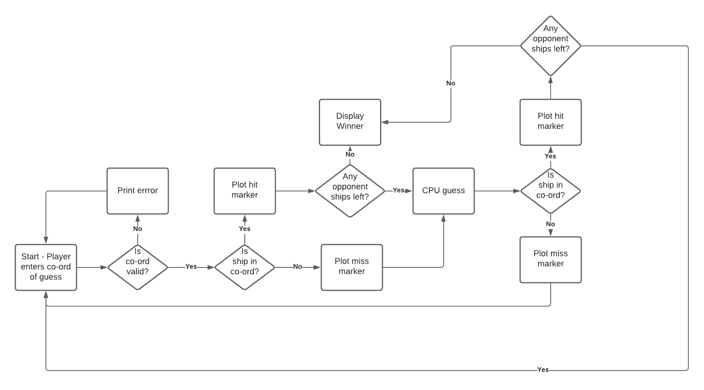

# Battleships

## Introduction

Battleship is a strategy type guessing game for two players it is played on a grid where each players ship is marked. The aim of the game is to guess where your opponent has marked their ships.

# UX

## External User Goal

The application user wants to play a strategy/logic game.

## User Stories

- As a user I want to play a battleships game.
- As a user I want to see where my ships are placed.
- As a user I want to see where I have guessed already.
- As a user I want to be corrected when I make errors.
- As a user I want to be able to play on any device size.

## Site Owner Goal

- Provide a working battleships game.

### Flow Chart

## Features
- User can set grid size
 list & add screenshots 

### Existing Features

### Features Left to Implement

## Technologies Used

- [Git]() version control
- [GitHub]() securely storing code
- [Gitpod]() cloud based IDE
- [Python3]() used for main code logic
- [Heroku]() used for live deployment

## Testing

To view all testing documention please refer to [TESTING.md](TESTING.md)

### Deployment

The site was deployed using [Heroku](https://heroku.com/). The app can be found using this link - [Battleships](https://devisis-battleships.herokuapp.com/).

The steps are as follows:

- Log-in or Sign-up to Heroku.
- From the Dashboard click "New" then "Create New App".
- Enter a project name (unique), select a region then press "Create app".
- This will create an app and open the deploy tab. From here select the "Settings" tab.
- Head to "Buildpacks" and select "Add Buildpack" from here select Python and Node.js and select save (make sure the order is python first then node.js).
- Scroll up and head to the "Deploy" section to choose deployment method. Select "GitHub" and in the "connect to GitHub" section link your GitHub account.
- Scroll down to the manual deploy option and select "Deploy Branch".
- The app will now be built. Once it has complet a 'Your App Was Successfully Deployed' message and a link will appear.

### Local Deployment

To make a local copy of this project, you can clone it by typing the following in your IDE terminal:

- `git clone https://github.com/devisis/battleships.git`

Alternatively, if using Gitpod, you can click below to create your own workspace using this repository.

Once your project is ready for coding, you must download the required dependencies from the requirements.txt file. You can type:

- `pip3 install -r requirements.txt`

Please note, for this particular project, there aren't any required dependencies, however, the file is still necessary in order to get the application running on Heroku.
Additionally, Heroku will require a `Procfile`, so you can type:

- `echo web: node index.js > Procfile`

### Credits

### Acknowledgements